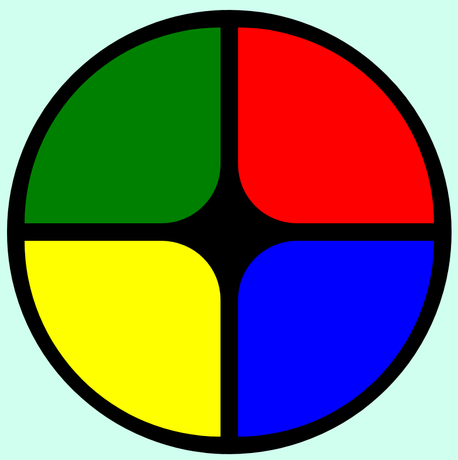

# Jogo Genius

Criação do jogo de memória Genius utilizando apenas HTML, CSS e JavaScript de forma introdutória, sendo o principal conceito, CSS Grid, manipulação de Array e Arrow Functions.

---

## Screenshot

---

